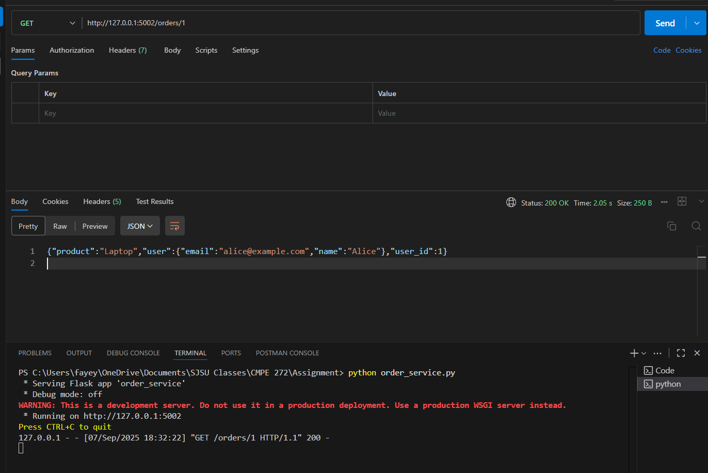

# Individual Assignments - Faye Yang
## Microservices Assignment
 web result of the users 

> 

 Using Postman to display the orders 

> 

## Building a Serverless Web Application Assignment
 DynamoDB table with sample records 

>

 Postman result for 'POST' request 

>

 Postman result for 'GET' request

>

Reflection:  Some of the challenges I faced were figuring out how to add the correct permissions to the account. When starting the assignment, I realized that I was not on a production account, but rather the root user, to which I logged into the root user account. I also struggled to figure out how to format the URL to display the correct information, as any mistakes will give me a permission requirement to access. 
